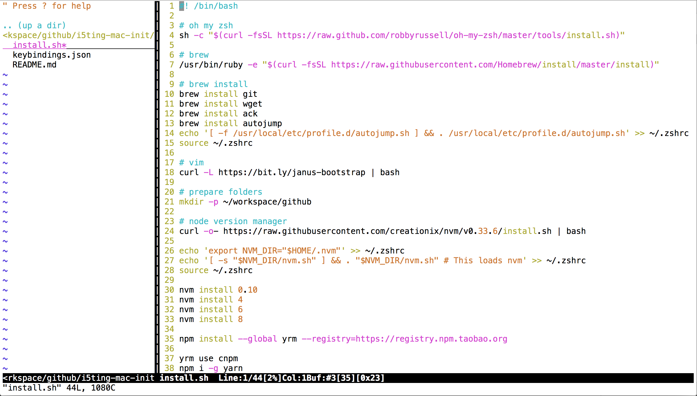
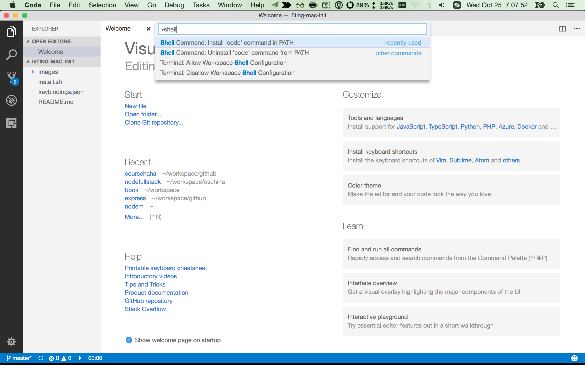
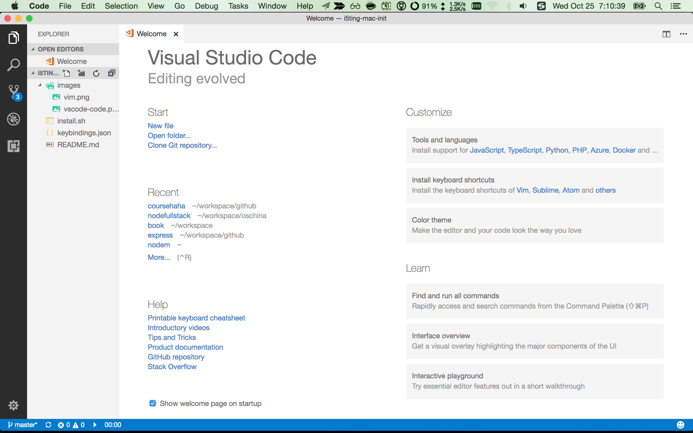

# i5timg-mac-init

自己Mac电脑初始化的安装脚本

## 1）oh my zsh是我最习惯的shell，终端下非常好用

配合iterm2分屏 + spectacle全屏，几乎无敌

## 2）brew是mac装软件非常好的方式，和apt-get、rpm等都非常类似

安装4个必备软件

- brew install git 最流行的SCM源码版本控制软件
- brew install wget 下载、扒站神器
- brew install ack  搜索代码神器
- brew install autojump 终端下多目录跳转神器

## 3）vim

我虽然不算vim党，但也深爱着。janus是一个非常好用的vim集成开发环境。比如ctrl-p、nerdtree等插件都集成了，对我这种懒人足够了。



## 4）准备工作目录

我的工作目录一般是 `~/workspace/github`

## 5）安装Node.js

- nvm安装个版本node
- 安装nrm，切换npm源为国内最快的cnpm
- 安装yarn，更好的npm替代软件
- 安装lazycommit，我自己写的一些shell别名，比如gs=git status
- 安装lazyclone，clone下来代码后，自动安装npm模块

## 6）ssh-keygen

生成ssh key（一路回车即可），上传到github或者gitlab都行

## 7）VSCode（手动）

下载安装VScode

- 配置code命令
- 配置快捷键
- 安装vsconde-icons插件

配置code命令



配置快捷键，最喜欢cmd + [1-5]，这和xcode习惯一直，非常棒

```
// 将键绑定放入此文件中以覆盖默认值
[
    { "key": "cmd+1",           "command": "workbench.view.explorer" },
    { "key": "cmd+2",           "command": "workbench.view.search" },
    { "key": "cmd+3",           "command": "workbench.view.scm" },
    { "key": "cmd+4",           "command": "workbench.view.debug" },
    { "key": "cmd+5",           "command": "workbench.view.extensions" }
]
```

安装vsconde-icons插件，对各种文件扩展都有icon显示，更直观



## 更多

- Node.js新手指南 https://github.com/i5ting/nodejs-newbie
- VSCode手册 https://github.com/i5ting/vsc
- Ask me anything in 《Node全栈》 https://github.com/i5ting/ama
